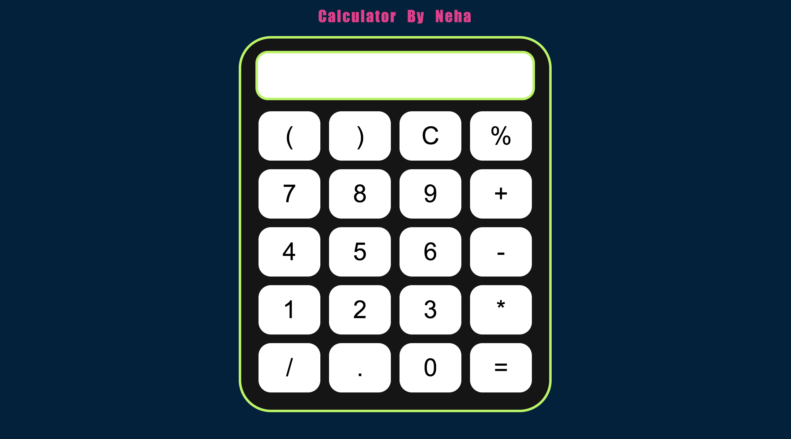

# Calculator App
Hello there this was my first JS project and I have made a simple calculator for addition, subtraction, multiplication and division..Hope you like it.

## Challanges : 
Since this was my first JavaScript project and i had to make a Calculator App. So there were lots of challanges for me like:

- Created a table inside index.html file
- created a style.css file for CSS styling
- Conditional statemenet (if else else if ) for addition, subtraction, multiplication and division.
- getElementById : to select the 'screen ' id
- addEventListener : to add an arrow function
- innerText : to return the text value only
- eval (): to evaluate mathematical expressions.

## Total time to complete the project
It took me around 4 hrs to complete this project.
